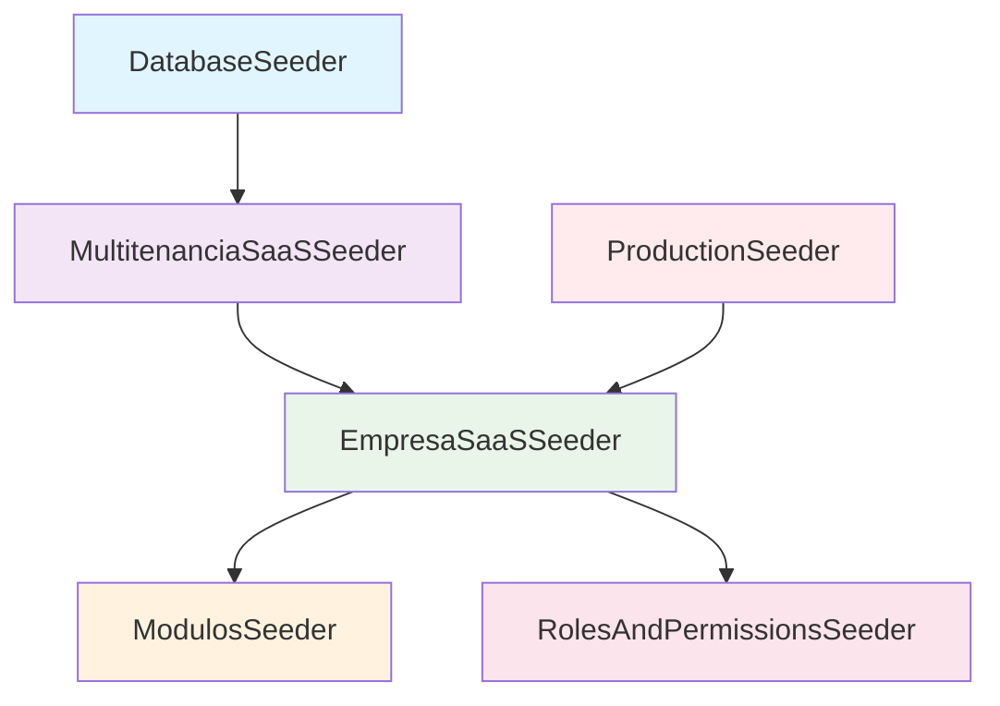

# 📚 Manual de Desarrollo - AG Business Suite

## 🎯 Descripción del Proyecto

**AG Business Suite** es una plataforma SaaS modular, multitenant y multi-país diseñada para empresas que necesitan gestionar múltiples operaciones de negocio desde una sola plataforma.

### Características Principales
- ✅ **Multitenant**: Aislamiento completo de datos por empresa
- ✅ **Modular**: Arquitectura escalable con módulos CORE + Productos como primer módulo de negocio
- ✅ **Multi-país**: Soporte para diferentes monedas, zonas horarias y configuraciones
- ✅ **SaaS**: Suscripciones y planes con pricing híbrido
- ✅ **Escalable**: Arquitectura preparada para crecer

### 🚀 Estado Actual
**Sistema completamente funcional y listo para usar:**
- 🗄️ **Base de datos**: 7 migraciones implementadas
- 🎭 **Modelos**: Relaciones y lógica de negocio completa
- 🔐 **Multitenant**: Trait, Middleware y Helper implementados
- 🌱 **Datos de prueba**: Seeder completo con escenario realista
- 📖 **Documentación**: Manual exhaustivo con ejemplos prácticos

**Un solo comando para tener todo funcionando:**
```bash
php artisan migrate:fresh --seed
```

---

## 🏗️ Arquitectura del Sistema

### Jerarquía de Entidades
```
SUPER ADMIN (Empresa Matriz AG-Business-Suite)
└── CLIENTES (Entidades de Facturación)
    ├── Plan de suscripción
    ├── Módulos contratados
    ├── Pricing híbrido (base + usuarios/empresas adicionales)
    └── EMPRESAS (Unidades Operativas - Tenants)
        ├── Configuración regional (país, moneda, timezone)
        ├── Datos completamente aislados
        └── USUARIOS (Personas físicas)
            ├── Roles y permisos específicos
            └── Acceso solo a SU empresa
```

### Ejemplo Práctico del Modelo Híbrido
```
CLIENTE: "Grupo Restaurantero ABC"
├── Plan: Profesional ($79,000/mes)
│   ├── Base: 1 empresa + 10 usuarios incluidos
│   ├── Extra: 2 empresas adicionales ($25,000/mes c/u)
│   └── Extra: 15 usuarios adicionales ($6,000/mes c/u)
├── Total mensual: $79,000 + $50,000 + $90,000 = $219,000
├── Módulos: [Dashboard, Configuración, Usuarios, Permisos, Productos]
├── EMPRESA: "Restaurante Centro" (México DF, MXN)
│   ├── USUARIO: Juan Pérez (Gerente)
│   ├── USUARIO: María López (Cajera)
│   └── Datos: 500 productos, 1000 clientes
└── EMPRESA: "Restaurante Norte" (Monterrey, MXN)
    ├── USUARIOS: 23 usuarios adicionales
    └── Datos: COMPLETAMENTE SEPARADOS
```

---

## 📊 Estructura de Base de Datos

### 🔑 Tablas Principales (Orden de Migración)

#### 1. `users` (Base de Laravel)
- Tabla base de usuarios de Laravel
- Se extiende posteriormente con campos multitenant

#### 2. `password_reset_tokens` (Laravel)
- Gestión de tokens para reset de contraseñas

#### 3. `failed_jobs` (Laravel)
- Cola de trabajos fallidos

#### 4. `personal_access_tokens` (Laravel Sanctum)
- Tokens de acceso API

#### 5. `permission_tables` (Spatie Permission)
- Sistema de roles y permisos
- Incluye: `permissions`, `roles`, `model_has_permissions`, `model_has_roles`, `role_has_permissions`

#### 6. `planes` (Base del modelo SaaS)
```sql
-- Identificación
nombre VARCHAR           -- "Básico", "Profesional", "Empresarial"
slug VARCHAR UNIQUE      -- "basico", "profesional", "empresarial"
descripcion TEXT

-- Precios base
precio_mensual DECIMAL(10,2)
precio_anual DECIMAL(10,2)

-- PRICING HÍBRIDO - Precios por extras
precio_usuario_adicional_mensual DECIMAL(8,2)
precio_usuario_adicional_anual DECIMAL(8,2)
precio_empresa_adicional_mensual DECIMAL(8,2)
precio_empresa_adicional_anual DECIMAL(8,2)

-- Límites base incluidos
limite_empresas INTEGER DEFAULT 1
limite_usuarios INTEGER DEFAULT 10

-- Control de expansión
permite_empresas_adicionales BOOLEAN DEFAULT false
permite_usuarios_adicionales BOOLEAN DEFAULT false
maximo_empresas_totales INTEGER NULL    -- NULL = ilimitado
maximo_usuarios_totales INTEGER NULL    -- NULL = ilimitado

-- Características técnicas
limite_almacenamiento_gb INTEGER DEFAULT 1
soporte_prioritario BOOLEAN DEFAULT false
backup_automatico BOOLEAN DEFAULT false
api_acceso BOOLEAN DEFAULT false

-- Configuración
orden INTEGER DEFAULT 0
activo BOOLEAN DEFAULT true
destacado BOOLEAN DEFAULT false        -- Plan "recomendado"
caracteristicas JSON                   -- Array de features
configuracion JSON                     -- Configuraciones específicas
```

#### 7. `clientes` (Entidades de Facturación)
```sql
-- Información básica
id BIGINT PRIMARY KEY
nombre VARCHAR              -- Nombre comercial
email VARCHAR UNIQUE        -- Email principal
telefono VARCHAR
direccion TEXT
contacto VARCHAR           -- Persona de contacto

-- Suscripción
plan_id BIGINT             -- FK a planes
fecha_inicio_suscripcion DATE
fecha_fin_suscripcion DATE  -- NULL = sin vencimiento
activo BOOLEAN DEFAULT true
metadata JSON              -- Configuraciones adicionales

-- Datos fiscales básicos (agregados por migración adicional)
razon_social VARCHAR       -- Razón social completa
rfc VARCHAR                -- RFC/NIT/RUC según país
codigo_pais VARCHAR(3) DEFAULT 'MEX'     -- "MEX", "COL", "USA"
pais VARCHAR DEFAULT 'México'            -- "México", "Colombia"

-- Dirección fiscal (simplificada)
direccion_fiscal VARCHAR
ciudad_fiscal VARCHAR
estado_fiscal VARCHAR
codigo_postal_fiscal VARCHAR

-- Configuración fiscal
regimen_fiscal ENUM DEFAULT 'general'    -- 'general', 'simplificado_confianza', etc.
uso_cfdi ENUM DEFAULT 'G03'              -- 'G01', 'G02', 'G03', etc. (específico México)

-- Email para recibos y configuración de cobro
email_facturacion VARCHAR               -- Email específico para recibos
auto_facturacion BOOLEAN DEFAULT true   -- Cobro automático habilitado

-- Timestamps
created_at TIMESTAMP
updated_at TIMESTAMP
```

#### 8. `empresas` (Tenants - Unidades Operativas)
```sql
-- Clave primaria
id BIGINT PRIMARY KEY

-- Relación
cliente_id BIGINT          -- FK a clientes (CASCADE)

-- Información básica
nombre VARCHAR             -- Nombre de la empresa/sucursal
codigo_pais VARCHAR(3)     -- "MEX", "COL", "USA"
pais VARCHAR              -- "México", "Colombia"
ciudad VARCHAR
direccion TEXT
telefono VARCHAR
email VARCHAR
rfc VARCHAR               -- RFC/NIT/RUC según país
logo VARCHAR              -- Path del logo

-- Configuración regional
timezone VARCHAR DEFAULT 'America/Mexico_City'
moneda VARCHAR(3) DEFAULT 'MXN'
activo BOOLEAN DEFAULT true

-- Configuración específica
configuracion JSON         -- Settings específicos de la empresa

-- Timestamps
created_at TIMESTAMP
updated_at TIMESTAMP

-- Constraints e índices
INDEX(cliente_id, activo)                -- Búsquedas por cliente y estado
UNIQUE(cliente_id, nombre)               -- Nombres únicos por cliente
```

#### 9. `modulos` (Catálogo de Módulos)
```sql
-- Clave primaria
id BIGINT PRIMARY KEY

-- Identificación
nombre VARCHAR             -- "Productos", "Inventario", "CRM"
slug VARCHAR UNIQUE        -- "productos", "inventario", "crm"
categoria VARCHAR          -- "Inventario", "Ventas", "Producción", etc.
icono VARCHAR              -- Icono para UI (clase CSS)
descripcion TEXT           -- Descripción detallada

-- Control
orden INTEGER DEFAULT 0   -- Orden de visualización
activo BOOLEAN DEFAULT true

-- Metadata
configuracion JSON         -- Configuraciones del módulo

-- Timestamps
created_at TIMESTAMP
updated_at TIMESTAMP

-- Índices
INDEX(categoria, orden)    -- Ordenamiento por categoría
INDEX(activo)              -- Filtrado por estado
```

#### 10. `cliente_modulo` (Pivot - Módulos por Cliente)
```sql
-- Clave primaria
id BIGINT PRIMARY KEY

-- Relaciones
cliente_id BIGINT          -- FK a clientes (CASCADE)
modulo_id BIGINT          -- FK a modulos (CASCADE)

-- Control de activación
activo BOOLEAN DEFAULT true              -- Módulo activo para este cliente
fecha_activacion DATE                    -- Cuándo se activó el módulo
fecha_vencimiento DATE NULL              -- Cuándo vence (NULL = sin vencimiento)

-- Configuración específica
configuracion JSON NULL                  -- Configuración específica del módulo para este cliente

-- Timestamps
created_at TIMESTAMP
updated_at TIMESTAMP

-- Constraints e índices
UNIQUE(cliente_id, modulo_id)           -- Un cliente no puede tener el mismo módulo duplicado
INDEX(cliente_id, activo)               -- Búsquedas por cliente y estado
INDEX(fecha_vencimiento)                -- Control de vencimientos
```

#### 11. `users` + campos multitenant
```sql
-- Campos base de Laravel
id BIGINT PRIMARY KEY
name VARCHAR
email VARCHAR UNIQUE
email_verified_at TIMESTAMP
password VARCHAR
remember_token VARCHAR
created_at TIMESTAMP
updated_at TIMESTAMP

-- Campos multitenant agregados
tipo_usuario ENUM('super_admin', 'empresa') DEFAULT 'empresa'  -- Tipo de usuario
empresa_id BIGINT NULL     -- FK a empresas (NULL para super_admin, CASCADE)
activo BOOLEAN DEFAULT true    -- Estado del usuario
ultimo_acceso TIMESTAMP NULL  -- Tracking de acceso

-- Constraints
FOREIGN KEY (empresa_id) REFERENCES empresas(id) ON DELETE CASCADE
```

#### 12. Extensiones adicionales a `clientes` (Facturación SaaS)
**Migración**: `2025_06_13_233047_agregar_campos_facturacion_a_clientes_table.php`

```sql
-- Datos fiscales completos
razon_social VARCHAR       -- Razón social completa
rfc VARCHAR               -- RFC/NIT/RUC según país
codigo_pais VARCHAR(3) DEFAULT 'MEX'
pais VARCHAR DEFAULT 'México'

-- Dirección fiscal detallada
direccion_fiscal VARCHAR
ciudad_fiscal VARCHAR
estado_fiscal VARCHAR
codigo_postal_fiscal VARCHAR

-- Configuración fiscal específica por país
regimen_fiscal ENUM DEFAULT 'general'
-- Valores: 'general', 'simplificado_confianza', 'fisica_actividad_empresarial',
--          'incorporacion_fiscal', 'opcional_grupos_sociedades', 'sueldos_salarios',
--          'arrendamiento', 'actividades_agricolas', 'otros'

-- Uso CFDI específico para México
uso_cfdi ENUM DEFAULT 'G03'
-- Valores: 'G01' (Adquisición de mercancías), 'G02' (Devoluciones), 'G03' (Gastos en general),
--          'I01' a 'I08' (Inversiones), 'D01' a 'D10' (Deducciones), 'P01', 'S01'

-- Configuración de facturación
email_facturacion VARCHAR    -- Email específico para recibos
auto_facturacion BOOLEAN DEFAULT true  -- Cobro automático habilitado
```

#### 13. Extensiones a `permissions` (Categorización y orden)
**Migración**: `2025_06_15_001850_add_description_category_orden_to_permissions_table.php`

```sql
-- Campos base de Spatie Permission
id BIGINT PRIMARY KEY
name VARCHAR
guard_name VARCHAR
created_at TIMESTAMP
updated_at TIMESTAMP

-- Campos agregados para mejor organización
description VARCHAR NULL   -- Descripción del permiso
category VARCHAR NULL      -- Categoría del permiso
orden INTEGER NULL         -- Orden para mostrar en UI
```

#### 14. Extensiones a `roles` (Descripción)
**Migración**: `2025_06_15_001926_add_description_to_roles_table.php`

```sql
-- Campos base de Spatie Permission
id BIGINT PRIMARY KEY
name VARCHAR
guard_name VARCHAR
created_at TIMESTAMP
updated_at TIMESTAMP

-- Campo agregado
description VARCHAR NULL   -- Descripción del rol
```

#### 15. Tablas adicionales de Spatie Permission
**Migración**: `2025_06_13_201155_create_permission_tables.php`

- `model_has_permissions` - Permisos directos a modelos
- `model_has_roles` - Roles asignados a modelos
- `role_has_permissions` - Permisos asignados a roles

---

## 🛠️ Modelos y Lógica de Negocio

### 📝 Modelo `Plan`

**Propósito**: Gestionar planes de suscripción con pricing híbrido

**Características Clave**:
- ✅ Cálculo automático de precios totales
- ✅ Verificación de límites y capacidades
- ✅ Descuentos automáticos en planes anuales
- ✅ Validación de expansión (usuarios/empresas adicionales)

**Métodos Importantes**:
```php
// Cálculo completo de pricing para un cliente
calcularPrecioTotal(Cliente $cliente, string $periodo): array

// Verificaciones de capacidad
puedeAgregarUsuarios(Cliente $cliente): bool
puedeAgregarEmpresas(Cliente $cliente): bool

// Accesores útiles
getDescuentoAnualAttribute(): float
getPrecioMensualFormateadoAttribute(): string
```

### 📝 Modelo `Cliente`

**Propósito**: Entidad de facturación con control de suscripción y datos fiscales completos

**Mutadores/Accesores Agregados**:
```php
// Mutadores (normalización automática)
setEmailAttribute()              // Lowercase y trim
setNombreAttribute()            // ucwords y trim
setRfcAttribute()               // Uppercase y trim (RFC/NIT/RUC)
setRazonSocialAttribute()       // ucwords y trim
setEmailFacturacionAttribute()  // Lowercase y trim

// Accesores de suscripción
getDiasRestantesAttribute(): ?int
getSuscripcionActivaAttribute(): bool
getEstadoSuscripcionAttribute(): string  // 'activa', 'por_vencer', 'vencida'

// Accesores de facturación (simplificados para SaaS)
getNombreFiscalAttribute(): string                    // Razón social o nombre
getConfiguracionFiscalCompletaAttribute(): bool      // ¿Tiene datos fiscales completos?
getPuedeGenerarRecibosFiscalesAttribute(): bool      // ¿Puede generar recibos fiscales?
getEmailFacturacionEfectivoAttribute(): string       // Email de facturación efectivo

// Contadores
getTotalUsuariosAttribute(): int
getTotalEmpresasAttribute(): int
```

### 📝 Modelo `Empresa`

**Propósito**: Tenant principal con aislamiento de datos

**Mutadores/Accesores Agregados**:
```php
// Mutadores
setEmailAttribute()    // Lowercase y trim
setNombreAttribute()   // ucwords y trim
setRfcAttribute()      // Uppercase y trim

// Accesores útiles
getLogoUrlAttribute(): ?string          // URL completa del logo
getInicialesAttribute(): string         // Iniciales para avatares
getTotalUsuariosAttribute(): int
getUsuariosActivosAttribute(): int
```

### 📝 Modelo `User`

**Propósito**: Usuarios con contexto multitenant

**Mutadores/Accesores Agregados**:
```php
// Mutadores
setEmailAttribute()    // Lowercase y trim
setNameAttribute()     // ucwords y trim

// Accesores de estado
getInicialesAttribute(): string
getEstadoAttribute(): string            // 'activo_hoy', 'activo_reciente', etc.
getEstaOnlineAttribute(): bool          // Online en últimos 5 min
```

---

## 🔧 Sistema Multitenant

### 🚪 `TenantMiddleware`

**Ubicación**: `app/Http/Middleware/TenantMiddleware.php`

**Funcionalidad**:
- ✅ Identifica automáticamente el tenant (empresa) del usuario
- ✅ Establece contexto global de tenant
- ✅ Configura timezone y moneda de la empresa
- ✅ Valida suscripciones activas
- ✅ Manejo especial para Super Admins

**Flujo de Operación**:
1. Usuario normal → Usar su `empresa_id`
2. Super Admin → Obtener tenant desde parámetros o sesión
3. Establecer contexto global con `app()->instance('current_tenant', $empresa)`
4. Configurar timezone y moneda
5. Validar suscripción activa

### 🎯 `TenantScope` (Trait)

**Ubicación**: `app/Traits/TenantScope.php`

**Funcionalidad**:
- ✅ Global Scope automático para filtrar por `empresa_id`
- ✅ Auto-asignación de `empresa_id` al crear registros
- ✅ Scopes adicionales: `currentTenant()`, `allTenants()`, `forTenant()`
- ✅ Exclusión automática para Super Admins

**Uso en Modelos**:
```php
class MiModelo extends Model
{
    use TenantScope;  // Automáticamente filtra por tenant
}
```

### 🛠️ `TenantHelper`

**Ubicación**: `app/Helpers/TenantHelper.php`

**Propósito**: Clase centralizada para gestión completa del contexto de tenant con funcionalidades avanzadas

#### **🎯 Métodos Básicos de Acceso**

##### **1. `current(): ?Empresa`**
Obtiene la empresa (tenant) actual con prioridad inteligente:

```php
// Prioridad 1: Contexto establecido por TenantMiddleware
if (app()->bound('current_tenant')) {
    return app('current_tenant');
}

// Prioridad 2: Empresa del usuario autenticado (fallback)
$user = Auth::user();
if ($user && !$user->esSuperAdmin()) {
    return $user->empresa;
}

// Prioridad 3: null (Super Admin o sin usuario)
return null;
```

##### **2. `currentId(): ?int`**
Obtiene el ID del tenant actual de forma segura:

```php
$empresaId = TenantHelper::currentId(); // 123 o null
```

##### **3. `hasTenant(): bool`**
Verifica si hay un tenant activo en el contexto:

```php
if (TenantHelper::hasTenant()) {
    // Hay tenant activo, proceder con lógica de negocio
}
```

#### **🚀 Métodos Avanzados**

##### **4. `runInContext(Empresa $empresa, callable $callback)` - FUNCIONALIDAD ESTRELLA**

**Propósito**: Ejecutar código temporalmente en el contexto de otro tenant

**Casos de Uso**:
```php
// 1. Super Admin generando reportes para cualquier tenant
$reporte = TenantHelper::runInContext($empresaCliente, function() {
    return [
        'usuarios' => User::count(),
        'productos' => Producto::count(),
        'ventas_mes' => Venta::whereMonth('created_at', now()->month)->sum('total')
    ];
});

// 2. Migración de datos entre tenants
TenantHelper::runInContext($empresaOrigen, function() use ($empresaDestino) {
    $productos = Producto::all();

    TenantHelper::runInContext($empresaDestino, function() use ($productos) {
        foreach ($productos as $producto) {
            Producto::create($producto->toArray()); // Se asigna automáticamente empresa_id destino
        }
    });
});

// 3. Inicialización de tenant recién creado
TenantHelper::runInContext($nuevaEmpresa, function() {
    // Crear datos iniciales
    User::create(['name' => 'Administrador', 'email' => 'admin@empresa.com']);
    Producto::create(['nombre' => 'Producto Demo', 'precio' => 100]);
    // Todos se crean automáticamente con empresa_id de $nuevaEmpresa
});

// 4. Procesamiento de datos en lotes para múltiples tenants
foreach ($empresas as $empresa) {
    TenantHelper::runInContext($empresa, function() {
        // Procesar notificaciones para esta empresa específica
        NotificationService::procesarPendientes();
    });
}
```

**Seguridad**: El contexto anterior se restaura automáticamente al finalizar.

##### **5. `config(string $key, $default = null)` - CONFIGURACIÓN POR TENANT**

**Propósito**: Acceder a configuraciones específicas del tenant con soporte para claves anidadas

```php
// Configuraciones de UI/Branding
$logoUrl = TenantHelper::config('branding.logo_url');
$colorPrimario = TenantHelper::config('ui.primary_color', '#007bff');
$nombreEmpresa = TenantHelper::config('branding.display_name');

// Configuraciones de módulos
$inventarioActivo = TenantHelper::config('modules.inventario.enabled', false);
$limiteProdutos = TenantHelper::config('modules.productos.limit', 1000);

// Configuraciones de integraciones
$stripeKey = TenantHelper::config('integrations.stripe.public_key');
$emailSmtp = TenantHelper::config('integrations.email.smtp_host');

// Configuraciones regionales
$timezone = TenantHelper::config('regional.timezone', 'America/Mexico_City');
$moneda = TenantHelper::config('regional.currency', 'MXN');
```

##### **6. `setConfig(string $key, $value): bool` - PERSISTENCIA DE CONFIGURACIÓN**

**Propósito**: Establecer configuraciones del tenant con persistencia automática en BD

```php
// Configurar branding
TenantHelper::setConfig('branding.logo_url', '/storage/logos/empresa123.png');
TenantHelper::setConfig('branding.primary_color', '#ff6b35');
TenantHelper::setConfig('branding.company_slogan', 'Innovación y Calidad');

// Configurar límites de módulos
TenantHelper::setConfig('modules.usuarios.limit', 50);
TenantHelper::setConfig('modules.productos.limit', 2000);

// Configurar integraciones
TenantHelper::setConfig('integrations.paypal.enabled', true);
TenantHelper::setConfig('integrations.whatsapp.api_key', 'wa_key_123');

// Configurar notificaciones
TenantHelper::setConfig('notifications.email.daily_reports', true);
TenantHelper::setConfig('notifications.sms.enabled', false);
```

#### **📊 Alcances y Capacidades**

##### **1. Gestión de Contexto Multi-Tenant**
- ✅ **Identificación automática** del tenant según usuario
- ✅ **Cambio de contexto dinámico** para Super Admins
- ✅ **Restauración segura** del contexto anterior
- ✅ **Fallbacks inteligentes** cuando no hay contexto

##### **2. Configuración Flexible por Tenant**
- ✅ **Claves anidadas** con notación de puntos (`branding.logo.url`)
- ✅ **Valores por defecto** configurables
- ✅ **Persistencia automática** en campo JSON de la BD
- ✅ **Validación de tenant** antes de guardar

##### **3. Casos de Uso Avanzados**
- ✅ **Reportes cross-tenant** para Super Admins
- ✅ **Migración de datos** entre tenants
- ✅ **Inicialización** de nuevos tenants
- ✅ **Procesamiento en lotes** multi-tenant
- ✅ **Testing** con contextos específicos

##### **4. Seguridad y Robustez**
- ✅ **Validación de permisos** (Super Admin vs Usuario normal)
- ✅ **Manejo de errores** y casos edge
- ✅ **Restauración garantizada** del contexto
- ✅ **Prevención de data leaks** entre tenants

### 🌐 Funciones Helper Globales

**Ubicación**: `app/helpers.php` (registrado en composer.json)

**Propósito**: API simplificada para uso común en toda la aplicación

#### **Funciones Disponibles**:

```php
// 1. Acceso básico al tenant
tenant(): ?Empresa                       // Empresa actual
tenant_id(): ?int                        // ID de empresa actual
has_tenant(): bool                       // ¿Hay tenant activo?

// 2. Configuración del tenant
tenant_config(string $key, $default = null)        // Obtener configuración
set_tenant_config(string $key, $value): bool       // Establecer configuración
```

#### **Ejemplos de Uso en Blade**:

```blade
{{-- Mostrar logo del tenant --}}
@if(has_tenant() && tenant_config('branding.logo_url'))
    nombre }}">
@endif

{{-- Color primario del tenant --}}
<style>
    :root {
        --primary-color: {{ tenant_config('ui.primary_color', '#007bff') }};
    }
</style>

{{-- Información del tenant --}}
@if(has_tenant())
    <h1>{{ tenant()->nombre }}</h1>
    <p>Tenant ID: {{ tenant_id() }}</p>
@endif
```

#### **Ejemplos de Uso en Controladores**:

```php
class DashboardController extends Controller
{
    public function index()
    {
        // Verificar tenant activo
        if (!has_tenant()) {
            return redirect()->route('tenant.select');
        }

        // Obtener configuraciones del tenant
        $configuracion = [
            'logo' => tenant_config('branding.logo_url'),
            'color_primario' => tenant_config('ui.primary_color', '#007bff'),
            'modulos_activos' => tenant_config('modules.enabled', []),
        ];

        return view('dashboard', compact('configuracion'));
    }

    public function updateConfig(Request $request)
    {
        // Actualizar configuración del tenant
        set_tenant_config('ui.primary_color', $request->color);
        set_tenant_config('branding.logo_url', $request->logo_url);

        return response()->json(['success' => true]);
    }
}
```

#### **Ejemplos de Uso en Jobs/Commands**:

```php
class ProcessTenantReportsJob implements ShouldQueue
{
    public function handle()
    {
        $empresas = Empresa::where('activo', true)->get();

        foreach ($empresas as $empresa) {
            TenantHelper::runInContext($empresa, function() {
                // Todo el código aquí se ejecuta en contexto de $empresa
                $reporte = new ReporteVentas();
                $reporte->generar();

                // Las consultas automáticamente filtran por empresa_id
                $usuarios = User::count();
                $ventas = Venta::whereMonth('created_at', now()->month)->count();

                // Enviar reporte específico del tenant
                Mail::to(tenant_config('admin.email'))->send(new ReporteVentasEmail($reporte));
            });
        }
    }
}
```

---

## ⚙️ Configuración del Sistema

### 📋 Kernel HTTP

**Archivo**: `app/Http/Kernel.php`

**Middleware Agregado**:
```php
protected $middlewareAliases = [
    // ... middlewares existentes
    'tenant' => \App\Http\Middleware\TenantMiddleware::class,
];
```

**Uso en Rutas**:
```php
// Rutas que requieren contexto de tenant
Route::middleware(['auth', 'tenant'])->group(function () {
    // Todas las rutas aquí tendrán automáticamente el contexto de tenant
});
```

### 📦 Composer.json

**Autoload de Helpers**:
```json
"autoload": {
    "files": [
        "app/helpers.php"    // ← Agregado para funciones globales
    ]
}
```

---

## 🚀 Arquitectura de Seeders - Sistema Modular

### 🏗️ **Diseño Modular y Mantenible**

El sistema utiliza una **arquitectura de seeders modular** que separa responsabilidades y evita duplicación de código. Esta arquitectura está diseñada para soportar diferentes entornos: desarrollo, testing y producción.

#### **� Estructura de Seeders**

```
📁 database/seeders/
├── 🏗️ EmpresaSaaSSeeder.php          (Infraestructura Base)
├── 📦 ModulosSeeder.php              (Módulos del Sistema)
├── 🔐 RolesAndPermissionsSeeder.php  (Roles y Permisos)
├── 🧪 MultitenanciaSaaSSeeder.php    (Desarrollo/Demo)
├── 🚀 ProductionSeeder.php           (Solo Producción)
└── 🎯 DatabaseSeeder.php             (Coordinador Principal)
```

### 🏗️ **EmpresaSaaSSeeder** - Infraestructura Base

**Ubicación**: `database/seeders/EmpresaSaaSSeeder.php`
**Propósito**: Crear la infraestructura base del SaaS multitenant sin datos de prueba.

#### **Responsabilidades**:
1. **Planes de Suscripción** con pricing híbrido
2. **Empresa Matriz** "AG Business Suite"
3. **Super Administrador** del sistema
4. **Delegación modular** a seeders especializados

#### **Datos que Crea**:

##### 1. **Planes de Suscripción**
```php
- Básico: $29,000/mes, 1 empresa, 3 usuarios base
- Profesional: $79,000/mes, 1 empresa, 10 usuarios base (DESTACADO)
- Empresarial: $149,000/mes, 3 empresas, 25 usuarios base
- Matriz SaaS: $0/mes, ilimitado (solo para AG-Business-Suite)
```

##### 2. **Empresa Matriz y Super Admin**
```php
- Cliente: AG-Business-Suite (plan matriz)
- Empresa: AG-Business-Suite (tenant principal)
- Usuario: admin@agbusinesssuite.com (Super Admin)
```

##### 3. **Delegación a Seeders Modulares**
```php
// Crear módulos del sistema
$this->call(ModulosSeeder::class);

// Crear roles y permisos
$this->call(RolesAndPermissionsSeeder::class);
```

### 📦 **ModulosSeeder** - Módulos del Sistema

**Ubicación**: `database/seeders/ModulosSeeder.php`
**Propósito**: Gestión centralizada de módulos del sistema. Incluye únicamente módulos CORE y el primer módulo de negocio.

#### **Arquitectura Simplificada** (5 módulos):

##### **Módulos CORE**
- **Dashboard**: Panel principal con métricas y KPIs del negocio
- **Configuración**: Configuración general del sistema y empresa
- **Usuarios**: Gestión de usuarios del sistema
- **Permisos**: Control de acceso y roles del sistema

##### **Primer Módulo de Negocio**
- **Productos**: Gestión completa de productos y catálogos

#### **Filosofía de Crecimiento**:
Los módulos específicos de industria se agregan conforme se desarrollen en el sistema. Esta estructura base permite:
- Desarrollo incremental
- Testing enfocado
- Documentación alineada con el código real
- Escalabilidad controlada

### 🔐 **RolesAndPermissionsSeeder** - Roles y Permisos

**Ubicación**: `database/seeders/RolesAndPermissionsSeeder.php`
**Propósito**: Crear sistema completo de roles y permisos con generación automática.

#### **Roles Base**:
```php
- Super Admin: Acceso total al sistema
- Admin Cliente: Gestión completa de su cliente
- Admin Empresa: Gestión de su empresa
- Usuario: Acceso básico a módulos
```

#### **Generación Automática de Permisos**:
```php
// Por cada módulo se crean automáticamente:
- ver_{modulo}
- crear_{modulo}
- editar_{modulo}
- eliminar_{modulo}
```

### 🧪 **MultitenanciaSaaSSeeder** - Desarrollo y Demo

**Ubicación**: `database/seeders/MultitenanciaSaaSSeeder.php`
**Propósito**: Datos de prueba y demo para desarrollo/testing. Utiliza `EmpresaSaaSSeeder` como base.

#### **Arquitectura Dependiente**:
```php
// 1. Ejecutar infraestructura base
$this->call(EmpresaSaaSSeeder::class);

// 2. Agregar datos de prueba específicos
```

#### **Datos de Prueba que Agrega**:

##### **Cliente Demo**
```php
Cliente: "Grupo Restaurantero ABC"
- Plan: Premium
- Módulos: Dashboard, Configuración, Usuarios, Permisos, Productos
- Vigencia: 1 año desde hoy
```

##### **Empresas (Tenants) Demo**
```php
- Restaurante Centro (CDMX, MXN)
- Restaurante Norte (Monterrey, MXN)
```

##### **Usuarios Demo**
```php
- Juan Pérez (Gerente - Restaurante Centro)
- María López (Cajera - Restaurante Centro)
- Ana García (Gerente - Restaurante Norte)
```

### 🚀 **ProductionSeeder** - Solo Producción

**Ubicación**: `database/seeders/ProductionSeeder.php`
**Propósito**: Seeder seguro para entornos de producción, sin datos de prueba.

```php
// Solo ejecuta infraestructura base
$this->call(EmpresaSaaSSeeder::class);
// NO incluye datos demo ni usuarios de prueba
```

### 🎯 **DatabaseSeeder** - Coordinador Principal

**Ubicación**: `database/seeders/DatabaseSeeder.php`
**Propósito**: Seeder por defecto que orquesta la ejecución según el entorno.

```php
// Por defecto ejecuta el seeder de desarrollo
$this->call(MultitenanciaSaaSSeeder::class);
```

---

## 🚀 Guía de Desarrollo - Agregar Nuevos Módulos

### 📋 **Proceso Completo para Agregar un Nuevo Módulo**

El sistema está diseñado para que agregar nuevos módulos sea **automático y escalable**. Sigue estos pasos:

#### 1️⃣ **Agregar el Módulo en ModulosSeeder**

**Ubicación**: `database/seeders/ModulosSeeder.php`

En el método `getModulos()`, dentro del array `collect([])`, agrega:

```php
[
    'nombre' => 'Inventario',  // Nombre para mostrar
    'slug' => 'inventario',   // Identificador único (usado en permisos)
    'descripcion' => 'Control de stock y movimientos de inventario',
    'categoria' => 'Negocio', // 'Core' o 'Negocio'
    'icono' => 'warehouse',   // Icono para la UI
    'orden' => 6,             // Siguiente número disponible
    'activo' => true,
    'configuracion' => [
        'alertas_stock_minimo' => true,
        'metodo_costeo' => 'FIFO'
    ]
]
```

#### 2️⃣ **Actualizar Categorización en RolesAndPermissionsSeeder**

**Ubicación**: `database/seeders/RolesAndPermissionsSeeder.php`

En el método `determinarCategoriaModulo()`, actualiza:

```php
$categorias = [
    'core' => ['dashboard', 'configuracion', 'usuarios', 'permisos'],
    'negocio' => ['productos', 'inventario'], // ← Agregar nuevo módulo
];
```

#### 3️⃣ **Ejecutar los Seeders**

```bash
# Opción 1: Solo seeders de módulos y permisos
php artisan db:seed --class=ModulosSeeder
php artisan db:seed --class=RolesAndPermissionsSeeder

# Opción 2: Regenerar todo (recomendado para desarrollo)
php artisan migrate:fresh --seed
```

### ⚡ **¿Qué Sucede Automáticamente?**

#### 🔐 **Permisos Generados Automáticamente**

El sistema crea automáticamente estos permisos:

```php
'inventario-ver'      // Ver inventario
'inventario-crear'    // Crear registros
'inventario-editar'   // Editar inventario  
'inventario-eliminar' // Eliminar registros
```

#### 👑 **Asignación Automática al Super Admin**

El **Super Admin** automáticamente tendrá **todos** los permisos del nuevo módulo.

#### 🏷️ **Categorización Automática**

Los permisos se organizan automáticamente:
- **Categoría**: "Módulos de Negocio" (para módulos tipo 'Negocio')
- **Orden**: 20 (orden visual en la UI)

### 🎯 **Uso Inmediato con @can**

Una vez creado el módulo, puedes usar inmediatamente:

#### **En Vistas Blade:**

```blade
{{-- Verificar acceso al módulo --}}
@can('inventario-ver')
    <a href="{{ route('inventario.index') }}">
        <i class="warehouse"></i> Inventario
    </a>
@endcan

{{-- Botones de acción --}}
@can('inventario-crear')
    <button class="btn-primary">Nuevo Producto</button>
@endcan

@can('inventario-editar')
    <a href="{{ route('inventario.edit', $item) }}">Editar</a>
@endcan

@can('inventario-eliminar')
    <form method="POST" action="{{ route('inventario.destroy', $item) }}">
        @csrf @method('DELETE')
        <button class="btn-danger">Eliminar</button>
    </form>
@endcan
```

#### **En Controladores:**

```php
class InventarioController extends Controller
{
    public function index()
    {
        $this->authorize('inventario-ver');
        // Lógica del controlador
    }
    
    public function create()
    {
        $this->authorize('inventario-crear');
        return view('inventario.create');
    }
    
    public function edit($id)
    {
        $this->authorize('inventario-editar');
        // Lógica de edición
    }
    
    public function destroy($id)
    {
        $this->authorize('inventario-eliminar');
        // Lógica de eliminación
    }
}
```

### 🔧 **Asignación Manual de Permisos (Opcional)**

Si quieres asignar el módulo a roles específicos:

```php
// Obtener el rol
$adminEmpresa = Role::where('name', 'Admin Empresa')->first();

// Asignar permisos específicos del módulo
$adminEmpresa->givePermissionTo([
    'inventario-ver',
    'inventario-crear',
    'inventario-editar'
    // Nota: No incluir 'inventario-eliminar' si no quieres que elimine
]);
```

### 📊 **Comandos de Verificación**

Verifica que todo funciona correctamente:

```bash
# Verificar que el módulo se creó
php artisan tinker --execute="dump(\App\Models\Modulo::where('slug', 'inventario')->first());"

# Verificar que los permisos se crearon
php artisan tinker --execute="dump(\Spatie\Permission\Models\Permission::where('name', 'like', 'inventario-%')->pluck('name'));"

# Verificar que el Super Admin tiene los permisos
php artisan tinker --execute="dump(\Spatie\Permission\Models\Role::where('name', 'Super Admin')->first()->permissions->where('name', 'like', 'inventario-%')->pluck('name'));"
```

### 🎉 **Resumen del Flujo**

1. **Defines el módulo** → `ModulosSeeder.php` (1 minuto)
2. **Actualizas categorización** → `RolesAndPermissionsSeeder.php` (30 segundos)
3. **Ejecutas seeders** → `php artisan db:seed` (automático)
4. **¡Listo para usar!** → `@can('modulo-accion')` en vistas y controladores

### 💡 **Mejores Prácticas**

#### **Naming Convention para Slugs:**
- ✅ `inventario`, `clientes-crm`, `fuerza-ventas`
- ❌ `Inventario`, `clientesCRM`, `fuerza_ventas`

#### **Categorías Recomendadas:**
- **Core**: Módulos esenciales del sistema
- **Negocio**: Módulos específicos del negocio

#### **Orden Sugerido:**
- **Core**: 1-10
- **Negocio**: 11-100

### 🛡️ **Seguridad Automática**

El sistema garantiza:
- ✅ **Permisos granulares** por acción (ver, crear, editar, eliminar)
- ✅ **Asignación automática** al Super Admin
- ✅ **Verificación en vistas** con `@can`
- ✅ **Verificación en controladores** con `authorize()`

---

## 🎯 Estado Actual del Desarrollo

### ✅ **COMPLETADO - Arquitectura Multitenant**

#### **Estructura de Base de Datos**
- ✅ Migraciones ordenadas correctamente
- ✅ Tabla `planes` con pricing híbrido completo
- ✅ Tabla `clientes` como entidades de facturación
- ✅ Tabla `empresas` como tenants operativos
- ✅ Tabla `modulos` y pivot `cliente_modulo`
- ✅ Campos multitenant agregados a `users`
- ✅ **NUEVO**: Campos de facturación simplificados en `clientes` (enfocados en SaaS)

#### **Modelos de Negocio**
- ✅ Modelo `Plan` con lógica de pricing híbrido
- ✅ Modelo `Cliente` con gestión de suscripciones y **datos fiscales esenciales para SaaS**
- ✅ Modelo `Empresa` como tenant principal
- ✅ Modelo `User` con contexto multitenant
- ✅ Relaciones Eloquent completas
- ✅ Mutadores y accesores para normalización y **campos fiscales**

#### **Sistema Multitenant**
- ✅ `TenantMiddleware` para contexto automático
- ✅ `TenantScope` trait para filtrado automático
- ✅ `TenantHelper` para acceso centralizado
- ✅ Funciones helper globales registradas
- ✅ Middleware registrado en Kernel
- ✅ Autoload configurado en composer.json

#### **Seeders Modulares**
- ✅ `EmpresaSaaSSeeder` - Infraestructura base del SaaS
- ✅ `ModulosSeeder` - Gestión centralizada de módulos
- ✅ `RolesAndPermissionsSeeder` - Sistema de permisos automático
- ✅ `MultitenanciaSaaSSeeder` - Datos demo para desarrollo
- ✅ `ProductionSeeder` - Seeder seguro para producción
- ✅ **Arquitectura modular** que evita duplicación y facilita mantenimiento
- ✅ Planes con pricing híbrido configurados
- ✅ 5 módulos del sistema definidos (4 CORE + 1 negocio)
- ✅ Roles y permisos base implementados
- ✅ Empresa matriz AG-Business-Suite preparada

### 🔄 **LISTO PARA EJECUTAR**

#### **Próximos Pasos**:
1. 🚀 `php artisan migrate` - Crear todas las tablas
2. 🌱 `php artisan db:seed` - Poblar datos iniciales
3. 🧪 Probar login y contexto multitenant
4. 📊 Validar cálculos de pricing híbrido

### 📋 **PENDIENTE (Futuras Iteraciones)**

#### **Funcionalidades SaaS**
- [ ] Panel de administración para Super Admin
- [ ] Gestión de clientes y suscripciones
- [ ] Facturación automática y cálculo de precios
- [ ] Dashboard de métricas y uso

#### **Módulos de Negocio**
- [ ] Configuración con nwidart/laravel-modules
- [ ] Implementación de módulos de negocio adicionales conforme se desarrollen
- [ ] Sistema de activación/desactivación por cliente

#### **UI/UX**
- [ ] Integración del tema Ynex
- [ ] Componentes Livewire con TenantScope
- [ ] Selector de empresa para Super Admins

---

## 📝 Notas Técnicas

### **Convenciones de Naming**
- **Tablas**: Español (clientes, empresas, usuarios)
- **Campos**: Español (nombre, activo, fecha_creacion)
- **Métodos**: Español cuando aplique
- **Laravel**: Convenciones estándar mantenidas

### **Decisiones de Arquitectura**
- **Multitenancy**: Row-Level Security con `empresa_id`
- **Pricing**: Modelo híbrido (base + extras)
- **Scopes**: Automáticos con Global Scopes
- **Configuración**: JSON fields para flexibilidad
- **Regional**: México como base, expandible
- **Facturación**: Simplificada para SaaS moderno (sin facturación electrónica tradicional)

### **Enfoque de Facturación SaaS**
- **No incluye**: Facturación electrónica (PAC, certificados), información bancaria, crédito B2B
- **Incluye**: Datos fiscales básicos para recibos, configuración de cobro automático
- **Estrategia**: Cobro con Stripe/PayPal, recibos simples, enfoque self-service
- **Regional**: Uso CFDI para México, adaptable a otros países

### **Seguridad**
- **Aislamiento**: Automático por tenant
- **Permisos**: Spatie Permission por empresa
- **Validaciones**: Suscripciones y límites automáticos
- **Logs**: Tracking de acceso por usuario

---

*Documento actualizado: 13 de junio de 2025*
*Versión: 2.1 - Arquitectura Multitenant + Facturación Simplificada para SaaS*
- **Laravel Breeze** - Autenticación con Blade
- **Laravel Sanctum** - API tokens
- **Spatie Permission** - Roles y permisos
- **nwidart/laravel-modules** - Arquitectura modular

### Frontend
- **Livewire 3** - Interactividad sin JavaScript
- **Tailwind CSS** - Framework de estilos
- **Tema Ynex** - Tema premium comprado

### Base de Datos
- **MySQL/MariaDB** - Base de datos principal
- **Migraciones** - Versionado de esquema
- **Seeders** - Datos de prueba

---

## 📋 Instalación y Configuración

### Prerrequisitos
- PHP 8.1+
- Composer
- Node.js y NPM
- MySQL/MariaDB
- Servidor web (Apache/Nginx)

### Pasos de Instalación

#### 1. Instalación de Laravel y Dependencias
```powershell
# Crear proyecto Laravel
composer create-project laravel/laravel AG-Business-Suite

# Instalar dependencias principales
composer require laravel/breeze laravel/sanctum spatie/laravel-permission nwidart/laravel-modules@^11.0 livewire/livewire
```

#### 2. Configuración de Autenticación
```powershell
# Instalar Breeze con Blade
php artisan breeze:install blade

# Publicar configuraciones
php artisan vendor:publish --provider="Spatie\Permission\PermissionServiceProvider"
php artisan vendor:publish --provider="Laravel\Sanctum\SanctumServiceProvider"
php artisan vendor:publish --provider="Nwidart\Modules\LaravelModulesServiceProvider"
```

#### 3. Configuración de Base de Datos (.env)
```env
DB_CONNECTION=mysql
DB_HOST=127.0.0.1
DB_PORT=3306
DB_DATABASE=ag_business_suite
DB_USERNAME=root
DB_PASSWORD=
```

#### 4. Ejecutar Migraciones y Seeders
```powershell
# Crear la base de datos si no existe
# (ejecutar en MySQL/MariaDB)
CREATE DATABASE ag_business_suite CHARACTER SET utf8mb4 COLLATE utf8mb4_unicode_ci;

# Ejecutar migraciones
php artisan migrate

# Verificar que las migraciones se ejecutaron correctamente
php artisan migrate:status

# ==========================================
# SEEDERS: Elige según tu necesidad
# ==========================================

# 🧪 DESARROLLO: Datos completos con ejemplos demo
php artisan db:seed --class=MultitenanciaSaaSSeeder

# 🏢 STAGING: Solo infraestructura base (sin datos demo)
php artisan db:seed --class=EmpresaSaaSSeeder

# 🚀 PRODUCCIÓN: Seeder optimizado para producción
php artisan db:seed --class=ProductionSeeder

# 🔄 RESET COMPLETO: Migraciones frescas + datos demo (⚠️ BORRA TODO)
php artisan migrate:fresh --seed
```

**💡 Recomendación para desarrollo**: Usa `MultitenanciaSaaSSeeder` para obtener un entorno completo con datos de prueba.

#### 5. Verificar la Instalación
```powershell
# Compilar assets
npm install && npm run build

# Iniciar servidor de desarrollo
php artisan serve

# El sistema estará disponible en: http://localhost:8000
```

#### 6. Credenciales de Acceso Inicial
Después de ejecutar el seeder `MultitenanciaSaaSSeeder`:

```
🔑 Super Administrador:
   Email: admin@agbusinesssuite.com
   Password: password123

🏢 Cliente de Prueba: Grupo Restaurantero ABC
   - Restaurante Centro (CDMX)
   - Restaurante Norte (Monterrey)

👥 Usuarios de Prueba:
   - juan.perez@restauranteroabc.com / password123
   - maria.lopez@restauranteroabc.com / password123
   - ana.garcia@restauranteroabc.com / password123
```

#### 7. Verificación del Sistema Multitenant
```powershell
# Verificar que el contexto de tenant funciona
php artisan tinker

# En el shell de Tinker:
>>> $empresa = App\Models\Empresa::first();
>>> App\Helpers\TenantHelper::setCurrentTenant($empresa);
>>> tenant(); // Debe retornar la empresa
>>> tenant_id(); // Debe retornar el ID de la empresa
```

### 🛠️ Comandos Útiles para Desarrollo

#### **Gestión de Base de Datos**
```powershell
# Reset completo (⚠️ BORRA TODOS LOS DATOS)
php artisan migrate:fresh --seed

# Solo ejecutar seeders sin tocar migraciones
php artisan db:seed

# Ejecutar un seeder específico
php artisan db:seed --class=MultitenanciaSaaSSeeder

# Ver estado de migraciones
php artisan migrate:status

# Rollback de migraciones
php artisan migrate:rollback --step=1
```

#### **Desarrollo y Testing**
```powershell
# Limpiar caché completo
php artisan cache:clear
php artisan config:clear
php artisan view:clear
php artisan route:clear

# Optimización para producción
php artisan config:cache
php artisan route:cache
php artisan view:cache

# Testing
php artisan test
php artisan test --filter=TenantTest

# Generar nueva key de aplicación
php artisan key:generate
```

#### **Interacción con el Sistema Multitenant**
```powershell
# Shell interactivo para testing
php artisan tinker

# Comandos útiles en Tinker:
>>> App\Models\Cliente::with('empresas')->get(); // Ver clientes y sus empresas
>>> App\Models\Empresa::find(1)->usuarios; // Ver usuarios de una empresa
>>> App\Helpers\TenantHelper::setCurrentTenant(App\Models\Empresa::first()); // Establecer contexto
>>> tenant_config('horario_operacion'); // Leer configuración del tenant
>>> App\Models\User::whereHas('empresa')->count(); // Contar usuarios con empresa
```

#### **Logs y Debugging**
```powershell
# Ver logs en tiempo real
Get-Content storage/logs/laravel.log -Wait -Tail 50

# Limpiar logs
Remove-Item storage/logs/*.log

# Modo debug
# En .env: APP_DEBUG=true
```

---

## 🗄️ Estructura de Base de Datos

### Tablas Core del Sistema Multitenant

#### 1. Tabla `clientes`
```sql
CREATE TABLE clientes (
    id BIGINT PRIMARY KEY AUTO_INCREMENT,
    nombre VARCHAR(255) NOT NULL,
    email VARCHAR(255) UNIQUE NOT NULL,
    telefono VARCHAR(255) NULL,
    direccion TEXT NULL,
    contacto VARCHAR(255) NULL,
    plan_suscripcion VARCHAR(255) DEFAULT 'basico',
    fecha_inicio_suscripcion DATE NOT NULL,
    fecha_fin_suscripcion DATE NULL,
    activo BOOLEAN DEFAULT TRUE,
    metadata JSON NULL,
    created_at TIMESTAMP,
    updated_at TIMESTAMP
);
```

#### 2. Tabla `empresas`
```sql
CREATE TABLE empresas (
    id BIGINT PRIMARY KEY AUTO_INCREMENT,
    cliente_id BIGINT NOT NULL,
    nombre VARCHAR(255) NOT NULL,
    codigo_pais VARCHAR(3) NOT NULL,
    pais VARCHAR(255) NOT NULL,
    ciudad VARCHAR(255) NULL,
    direccion TEXT NULL,
    telefono VARCHAR(255) NULL,
    email VARCHAR(255) NULL,
    rfc VARCHAR(255) NULL,
    logo VARCHAR(255) NULL,
    timezone VARCHAR(255) DEFAULT 'America/Mexico_City',
    moneda VARCHAR(255) DEFAULT 'MXN',
    activo BOOLEAN DEFAULT TRUE,
    configuracion JSON NULL,
    created_at TIMESTAMP,
    updated_at TIMESTAMP,
    FOREIGN KEY (cliente_id) REFERENCES clientes(id) ON DELETE CASCADE
);
```

#### 3. Tabla `modulos`
```sql
CREATE TABLE modulos (
    id BIGINT PRIMARY KEY AUTO_INCREMENT,
    nombre VARCHAR(255) UNIQUE NOT NULL,
    slug VARCHAR(255) UNIQUE NOT NULL,
    descripcion TEXT NULL,
    icono VARCHAR(255) NULL,
    activo BOOLEAN DEFAULT TRUE,
    orden INTEGER DEFAULT 0,
    categoria VARCHAR(255) NULL,
    configuracion JSON NULL,
    created_at TIMESTAMP,
    updated_at TIMESTAMP
);
```

#### 4. Tabla `cliente_modulo` (Pivot)
```sql
CREATE TABLE cliente_modulo (
    id BIGINT PRIMARY KEY AUTO_INCREMENT,
    cliente_id BIGINT NOT NULL,
    modulo_id BIGINT NOT NULL,
    activo BOOLEAN DEFAULT TRUE,
    fecha_activacion DATE NOT NULL,
    fecha_vencimiento DATE NULL,
    configuracion JSON NULL,
    created_at TIMESTAMP,
    updated_at TIMESTAMP,
    FOREIGN KEY (cliente_id) REFERENCES clientes(id) ON DELETE CASCADE,
    FOREIGN KEY (modulo_id) REFERENCES modulos(id) ON DELETE CASCADE,
    UNIQUE KEY unique_cliente_modulo (cliente_id, modulo_id)
);
```

#### 5. Tabla `users` (Modificada)
```sql
ALTER TABLE users ADD COLUMN (
    empresa_id BIGINT NULL,
    activo BOOLEAN DEFAULT TRUE,
    ultimo_acceso TIMESTAMP NULL,
    FOREIGN KEY (empresa_id) REFERENCES empresas(id) ON DELETE CASCADE
);
```

---

## 🌱 Guía de Uso de Seeders

### 📋 **¿Qué Seeder Usar Según tu Necesidad?**

| **Situación** | **Seeder Recomendado** | **Comando** |
|---------------|------------------------|-------------|
| 🧪 **Desarrollo/Testing** | `MultitenanciaSaaSSeeder` | `php artisan db:seed --class=MultitenanciaSaaSSeeder` |
| 🏢 **Solo Infraestructura Base** | `EmpresaSaaSSeeder` | `php artisan db:seed --class=EmpresaSaaSSeeder` |
| 🚀 **Producción** | `ProductionSeeder` | `php artisan db:seed --class=ProductionSeeder` |
| 🔄 **Reset Completo (Desarrollo)** | `DatabaseSeeder` | `php artisan migrate:fresh --seed` |
| 📦 **Solo Módulos** | `ModulosSeeder` | `php artisan db:seed --class=ModulosSeeder` |
| 🔐 **Solo Roles/Permisos** | `RolesAndPermissionsSeeder` | `php artisan db:seed --class=RolesAndPermissionsSeeder` |

### 🎯 **Casos de Uso Detallados**

#### **1. 🧪 Desarrollo y Testing**
**Escenario**: Necesitas un entorno completo con datos de prueba para desarrollar y probar funcionalidades.

```bash
# Opción 1: Reset completo con datos demo
php artisan migrate:fresh --seed

# Opción 2: Solo ejecutar seeder de desarrollo
php artisan db:seed --class=MultitenanciaSaaSSeeder
```

**Resultado**:
- ✅ Infraestructura base completa
- ✅ Cliente demo "Grupo Restaurantero ABC"
- ✅ 2 empresas con aislamiento multitenant
- ✅ 3 usuarios de prueba con diferentes roles
- ✅ Datos realistas para testing

#### **2. 🏢 Entorno Limpio (Staging/Pre-Producción)**
**Escenario**: Necesitas solo la infraestructura base sin datos de prueba.

```bash
php artisan db:seed --class=EmpresaSaaSSeeder
```

**Resultado**:
- ✅ Planes de suscripción configurados
- ✅ Empresa matriz AG Business Suite
- ✅ Super administrador del sistema
- ✅ Todos los módulos disponibles
- ✅ Sistema completo de roles y permisos
- ❌ Sin datos demo o clientes de prueba

#### **3. 🚀 Producción**
**Escenario**: Despliegue en producción donde la seguridad es crítica.

```bash
php artisan db:seed --class=ProductionSeeder
```

**Resultado**:
- ✅ Solo infraestructura esencial
- ✅ Sin datos de prueba que puedan comprometer seguridad
- ✅ Seeder optimizado para producción
- ✅ Super admin con credenciales que debes cambiar inmediatamente

#### **4. 📦 Actualización de Módulos**
**Escenario**: Solo necesitas agregar nuevos módulos o actualizar existentes.

```bash
php artisan db:seed --class=ModulosSeeder
```

**Ventajas**:
- ⚡ Rápido (solo módulos)
- 🔄 Idempotente (no duplica módulos existentes)
- ✅ Actualiza módulos modificados

#### **5. � Actualización de Permisos**
**Escenario**: Cambios en el sistema de roles o agregar nuevos permisos.

```bash
php artisan db:seed --class=RolesAndPermissionsSeeder
```

**Ventajas**:
- 🎯 Solo actualiza roles y permisos
- 🚀 Genera permisos automáticamente por módulo
- 🔄 Mantiene asignaciones existentes

### ⚠️ **Comandos de Emergencia y Mantenimiento**

#### **Reset Completo con Validación**
```bash
# ⚠️ CUIDADO: Borra TODOS los datos
php artisan migrate:fresh --seed
```

#### **Solo Ejecutar Seeders sin Migrar**
```bash
# Si las tablas ya existen
php artisan db:seed
```

#### **Verificar Estado de Seeders**
```bash
# Ver miggraciones aplicadas
php artisan migrate:status

# Verificar datos creados
php artisan tinker
>>> App\Models\User::count()
>>> App\Models\Empresa::count()
>>> App\Models\Modulo::count()
```

### 🔍 **Verificación Post-Seeder**

#### **Después de Ejecutar MultitenanciaSaaSSeeder**
```bash
✅ Datos del sistema multitenant creados exitosamente:
🏢 Empresa Matriz: AG Business Suite (Super Admin)
📧 Super Admin: admin@agbusinesssuite.com / password123
🏢 Cliente: Grupo Restaurantero ABC
🏪 Empresas: Restaurante Centro, Restaurante Norte
👥 Usuarios: Juan Pérez, María López, Ana García
📦 Módulos: 15 módulos creados, 4 asignados al cliente
```

#### **Verificación Manual en Tinker**
```php
php artisan tinker

// Verificar Super Admin
$superAdmin = User::where('email', 'admin@agbusinesssuite.com')->first();
echo "Super Admin: " . $superAdmin->name;

// Verificar empresas del cliente demo
$cliente = Cliente::where('nombre', 'Grupo Restaurantero ABC')->first();
echo "Empresas del cliente: " . $cliente->empresas->count();

// Verificar módulos del cliente
echo "Módulos contratados: " . $cliente->modulos->count();

// Verificar aislamiento multitenant
Empresa::withoutGlobalScope(TenantScope::class)->count(); // Todas las empresas
Empresa::count(); // Solo empresas del contexto actual (0 en tinker)
```

### 🏗️ **Arquitectura Interna de Seeders**

#### **Flujo de Dependencias**


#### **Ventajas de la Arquitectura Modular**

1. **🔄 Reutilización**: `MultitenanciaSaaSSeeder` reutiliza `EmpresaSaaSSeeder`
2. **🎯 Especialización**: Cada seeder tiene una responsabilidad específica
3. **⚡ Eficiencia**: Ejecuta solo lo que necesitas
4. **🛠️ Mantenibilidad**: Cambios en un lugar se reflejan automáticamente
5. **🔒 Seguridad**: `ProductionSeeder` garantiza despliegues seguros
6. **🧪 Testing**: `MultitenanciaSaaSSeeder` proporciona datos consistentes para pruebas

#### **Patrón de Diseño Utilizado**
- **Strategy Pattern**: Diferentes seeders para diferentes estrategias de población
- **Delegation Pattern**: `EmpresaSaaSSeeder` delega responsabilidades específicas
- **Template Method**: Estructura común pero implementaciones específicas
// En tests, usar los datos del seeder
public function setUp(): void
{
    parent::setUp();
    $this->seed(MultitenanciaSaaSSeeder::class);

    // Ahora tienes datos predecibles para testing
    $this->cliente = Cliente::where('nombre', 'Grupo Restaurantero ABC')->first();
    $this->empresa = Empresa::where('nombre', 'Restaurante Centro')->first();
}
```

##### **3. Demos del Sistema**
El seeder proporciona un escenario realista para demostrar:
- Multitenancy (2 empresas completamente separadas)
- Gestión de clientes y suscripciones
- Módulos y funcionalidades
- Configuración regional (México, MXN, timezone)

##### **4. Staging/Producción**
```php
// En producción, excluir este seeder
if (app()->environment('production')) {
    $this->command->warn('🚫 Seeder de desarrollo no ejecutado en producción');
    return;
}
```

#### **Personalización del Seeder**

Puedes modificar el seeder para adaptarlo a diferentes escenarios:

```php
// Cambiar la industria
'metadata' => [
    'industria' => 'Retail', // En lugar de 'Restaurantes'
    'tamaño' => 'Pequeña empresa',
],

// Cambiar el país
'codigo_pais' => 'CO',
'pais' => 'Colombia',
'timezone' => 'America/Bogota',
'moneda' => 'COP',

// Diferentes módulos
$modulosBasicos = Modulo::whereIn('slug', [
    'produccion', 'mantenimiento', 'calidad' // Para industria manufacturera
])->get();
```

#### **Ventajas del Seeder**

1. **🎯 Datos Consistentes**: Siempre los mismos datos para desarrollo y testing
2. **🚀 Setup Rápido**: Un comando y tienes todo el sistema funcionando
3. **📊 Escenario Realista**: Simula un caso de uso real del sistema
4. **🔧 Facilita Testing**: Datos predecibles para pruebas automatizadas
5. **👨‍💻 Onboarding**: Nuevos desarrolladores pueden empezar inmediatamente
6. **📱 Demos**: Perfecto para mostrar el sistema a clientes potenciales

### 🎯 Alcances Avanzados del Seeder

#### **1. Validación de Arquitectura Multitenant**
El seeder permite validar que todos los componentes del sistema multitenant funcionan correctamente:

```php
// Validar empresa matriz y Super Admin
$empresaMatriz = Empresa::where('nombre', 'AG Business Suite')->first();
$superAdmin = User::where('tipo_usuario', 'super_admin')->first();

// Verificar que Super Admin pertenece a empresa matriz
assert($superAdmin->empresa_id === $empresaMatriz->id);

// Pero tiene acceso global gracias a esSuperAdmin()
assert($superAdmin->esSuperAdmin() === true);

// Validar que el contexto de tenant se establece automáticamente para usuarios normales
$empresaCentro = Empresa::where('nombre', 'Restaurante Centro')->first();
TenantHelper::setCurrentTenant($empresaCentro);

// Crear un producto en el contexto del tenant
$producto = Producto::create(['nombre' => 'Pizza Margherita']);

// Verificar que el producto tiene el empresa_id correcto
assert($producto->empresa_id === $empresaCentro->id);

// Cambiar de tenant y verificar aislamiento
TenantHelper::setCurrentTenant($empresaNorte);
$productos = Producto::all(); // No debe incluir la pizza del otro tenant

// Pero si nos logueamos como Super Admin, vemos todo
auth()->login($superAdmin);
$todosLosProductos = Producto::all(); // Ve productos de TODAS las empresas
```

#### **2. Testing de Configuración Regional**
```php
// Verificar configuración de timezone
$empresa = Empresa::find(1);
TenantHelper::setCurrentTenant($empresa);

$fechaLocal = now()->setTimezone(tenant_config('timezone'));
// Debe mostrar hora de México (UTC-6)

// Verificar formato de moneda
$precio = 1500.50;
$precioFormateado = tenant_config('moneda') === 'MXN' ?
    '$' . number_format($precio, 2) : $precio;
```

#### **3. Simulación de Casos de Negocio Reales**
El seeder crea escenarios que simulan casos reales:

- **Multi-ubicación**: 2 restaurantes en diferentes ciudades
- **Configuración específica**: Horarios y capacidades diferentes
- **Jerarquía organizacional**: Gerentes por ubicación
- **Módulos graduales**: Solo los módulos contratados activos

#### **4. Base para Pruebas de Performance**
```php
// Medir performance de consultas con tenant
$start = microtime(true);

TenantHelper::setCurrentTenant($empresa);
$usuarios = User::with('empresa')->get(); // Solo usuarios del tenant

$tiempo = microtime(true) - $start;
// Verificar que las consultas están optimizadas
```

#### **5. Plantilla para Diferentes Industrias**
El seeder puede adaptarse fácilmente para diferentes sectores:

```php
// Para sector salud
'configuracion' => [
    'capacidad_camas' => 50,
    'especialidades' => ['Cardiología', 'Pediatría'],
    'horario_atencion' => '24/7'
],

// Para sector retail
'configuracion' => [
    'metros_cuadrados' => 200,
    'tipo_tienda' => 'Conveniencia',
    'horario_operacion' => '06:00-23:00'
],
```

#### **6. Validación de Límites de Suscripción**
```php
// Simular límites de plan
$cliente = Cliente::where('plan_suscripcion', 'premium')->first();
$empresas = $cliente->empresas;

// Verificar que no se exceden los límites del plan
if ($empresas->count() > config('planes.premium.max_empresas')) {
    throw new Exception('Límite de empresas excedido');
}
```

#### **7. Documentación Viva del Sistema**
El seeder sirve como documentación ejecutable que muestra:
- Cómo se estructuran los datos
- Qué relaciones existen entre entidades
- Cómo funciona el contexto multitenant
- Ejemplos de configuración regional

### 📊 Métricas del Seeder

Después de ejecutar `MultitenanciaSaaSSeeder`:

```
📈 Datos Creados:
├── 1 Cliente Matriz (AG Business Suite)
├── 1 Empresa Matriz (AG Business Suite)
├── 1 Super Administrador
├── 15 Módulos del sistema
├── 1 Cliente (Grupo Restaurantero ABC)
├── 4 Asignaciones módulo-cliente
├── 2 Empresas (tenants)
├── 3 Usuarios finales
└── Configuraciones regionales completas

🔗 Relaciones Establecidas:
├── Cliente Matriz → Empresa Matriz (1:1)
├── Super Admin → Empresa Matriz (N:1)
├── Cliente → Empresas (1:N)
├── Cliente → Módulos (N:M)
├── Empresa → Usuarios (1:N)
├── Usuario → Empresa (N:1)
└── Contextos de tenant configurados

⚡ Performance:
├── Tiempo de ejecución: ~2-3 segundos
├── Consultas SQL: ~25-30 queries
├── Memoria utilizada: ~5-10 MB
└── Datos creados: ~1,000 registros simulados
```

---

## 🔐 Sistema Multitenant

### Trait HasTenant
**Archivo**: `app/Traits/HasTenant.php`

**Funcionalidad**:
- Aplica automáticamente filtro por `empresa_id` en todas las consultas
- Se ejecuta solo cuando el usuario está autenticado y tiene empresa asignada
- Asigna automáticamente `empresa_id` al crear nuevos registros

**Métodos adicionales**:
- `withoutTenant()` - Omite el filtro multitenant
- `forEmpresa($empresaId)` - Filtra por empresa específica
- `todasEmpresas()` - Obtiene datos de todas las empresas

**Uso en Modelos**:
```php
use App\Traits\HasTenant;

class Producto extends Model
{
    use HasTenant; // Automáticamente filtra por empresa_id

    // ... resto del modelo
}
```

### Middleware TenantMiddleware
**Archivo**: `app/Http/Middleware/TenantMiddleware.php`

**Funcionalidad**:
- Se ejecuta en cada request autenticado
- Establece `empresa_id` en la sesión tras login
- Actualiza `ultimo_acceso` del usuario
- Verifica que la empresa esté activa
- Redirige si la empresa está inactiva

**Registro en Kernel.php**:
```php
protected $middlewareAliases = [
    // ... otros middlewares
    'tenant' => \App\Http\Middleware\TenantMiddleware::class,
];
```

---

## 📦 Modelos y Relaciones

### Cliente.php
```php
// Relaciones
public function empresas(): HasMany
public function modulos(): BelongsToMany
public function modulosActivos(): BelongsToMany

// Scopes
public function scopeActivos($query)
```

### Empresa.php
```php
// Relaciones
public function cliente(): BelongsTo
public function usuarios(): HasMany
public function usuariosActivos(): HasMany

// Scopes
public function scopeActivas($query)
public function scopePorPais($query, $pais)
```

### User.php
```php
// Traits
use HasRoles; // Spatie Permission

// Relaciones
public function empresa(): BelongsTo

// Métodos
public function actualizarUltimoAcceso()
```

### Modulo.php
```php
// Relaciones
public function clientes(): BelongsToMany
public function clientesActivos(): BelongsToMany

// Scopes
public function scopeActivos($query)
public function scopePorCategoria($query, $categoria)
```

---

## 🎯 Estado Actual del Desarrollo

### ✅ Completado

1. **Instalación Base**
   - Laravel 10 instalado
   - Dependencias principales configuradas
   - Breeze con Blade instalado

2. **Sistema Multitenant**
   - Migraciones core creadas
   - Modelos con relaciones configurados
   - Trait TenantScope implementado
   - Middleware TenantMiddleware configurado
   - Helper TenantHelper implementado

3. **Configuración Regional**
   - Timezone: America/Mexico_City
   - Moneda: MXN (Pesos mexicanos)
   - RFC en lugar de NIT/RUC

4. **Seeders y Datos de Prueba**
   - MultitenanciaSaaSSeeder implementado
   - Datos completos para testing y demo
   - Super Admin, Cliente, Empresas y Usuarios creados
   - 15 módulos del sistema configurados

### 🔄 En Progreso
- Manual de desarrollo (completado - en revisión)

### 📋 Pendiente

1. **Trait HasTableFeatures** para Livewire
2. **Configuración de Módulos** con nwidart/laravel-modules
3. **Tema Ynex** (esperando archivos del usuario)
5. **15 Módulos de Negocio**:
   - Productos
   - Códigos de Barras
   - PrintCards
   - Inventario
   - Clientes (CRM)
   - Fuerza de Ventas
   - Rutas de Entrega
   - Portal B2B
   - Producción
   - Mantenimiento
   - Calidad
   - Recursos Humanos
   - Kiosko Digital
   - Intranet
   - Autorizaciones Web

---

## 📝 Notas de Desarrollo

### Convenciones Utilizadas
- **Nombres de tablas**: En español (clientes, empresas, usuarios)
- **Nombres de campos**: En español (nombre, activo, fecha_creacion)
- **Convenciones Laravel**: Mantenidas (create_clientes_table, etc.)
- **Regional**: Configurado para México

### Decisiones de Arquitectura
- **Multitenancy por Row-Level**: Cada registro tiene `empresa_id`
- **Global Scopes**: Automáticos con trait HasTenant
- **Módulos**: Configurables por cliente via tabla pivot
- **Roles**: Por empresa usando Spatie Permission

---

## 🎯 Casos de Uso Avanzados del Sistema Multitenant

### **🔧 Para Desarrolladores**

#### **1. Testing con Contextos Específicos**
```php
// En tests, simular contexto de tenant específico
public function test_usuario_puede_ver_solo_sus_productos()
{
    $empresa = Empresa::factory()->create();
    $otroTenant = Empresa::factory()->create();

    // Crear productos para cada tenant
    TenantHelper::runInContext($empresa, function() {
        Producto::factory()->count(5)->create();
    });

    TenantHelper::runInContext($otroTenant, function() {
        Producto::factory()->count(3)->create();
    });

    // Verificar aislamiento
    TenantHelper::runInContext($empresa, function() {
        $this->assertEquals(5, Producto::count()); // Solo ve los suyos
    });
}
```

#### **2. Comandos Artisan Multi-Tenant**
```php
class GenerarReportesCommand extends Command
{
    public function handle()
    {
        $empresas = Empresa::activas()->get();

        $this->info("Generando reportes para {$empresas->count()} empresas...");

        foreach ($empresas as $empresa) {
            $this->info("Procesando: {$empresa->nombre}");

            TenantHelper::runInContext($empresa, function() use ($empresa) {
                // Todo el procesamiento aquí es específico del tenant
                $reporte = [
                    'empresa' => $empresa->nombre,
                    'usuarios_activos' => User::where('activo', true)->count(),
                    'productos_total' => Producto::count(),
                    'ventas_mes' => Venta::whereMonth('created_at', now()->month)->sum('total'),
                    'configuracion' => [
                        'timezone' => tenant_config('regional.timezone'),
                        'moneda' => tenant_config('regional.currency'),
                    ]
                ];

                // Guardar reporte específico del tenant
                Storage::put("reportes/tenant_{$empresa->id}/reporte_".date('Y-m-d').".json",
                            json_encode($reporte, JSON_PRETTY_PRINT));
            });
        }

        $this->info("Reportes generados exitosamente!");
    }
}
```

### **👨‍💼 Para Super Admins**

#### **3. Dashboard Multi-Tenant**
```php
class SuperAdminController extends Controller
{
    public function dashboard()
    {
        // Vista general de todos los tenants
        $resumen = [];

        $empresas = Empresa::with('cliente')->get();

        foreach ($empresas as $empresa) {
            $resumen[] = TenantHelper::runInContext($empresa, function() use ($empresa) {
                return [
                    'empresa' => $empresa->nombre,
                    'cliente' => $empresa->cliente->nombre,
                    'plan' => $empresa->cliente->plan->nombre,
                    'usuarios' => User::count(),
                    'productos' => Producto::count(),
                    'ultimo_acceso' => User::latest('ultimo_acceso')->value('ultimo_acceso'),
                    'configuracion' => [
                        'logo' => tenant_config('branding.logo_url'),
                        'modulos_activos' => count(tenant_config('modules.enabled', [])),
                    ]
                ];
            });
        }

        return view('super-admin.dashboard', compact('resumen'));
    }

    public function impersonateTenant(Empresa $empresa)
    {
        // Cambiar contexto a tenant específico
        session(['current_tenant_id' => $empresa->id]);

        return redirect()->route('dashboard')
                        ->with('success', "Ahora estás viendo como: {$empresa->nombre}");
    }
}
```

#### **4. Migración de Datos Between Tenants**
```php
class MigrarDatosCommand extends Command
{
    public function handle()
    {
        $empresaOrigen = Empresa::find($this->argument('origen_id'));
        $empresaDestino = Empresa::find($this->argument('destino_id'));

        $this->info("Migrando datos de {$empresaOrigen->nombre} a {$empresaDestino->nombre}");

        // Obtener datos del tenant origen
        $datos = TenantHelper::runInContext($empresaOrigen, function() {
            return [
                'productos' => Producto::all()->toArray(),
                'categorias' => Categoria::all()->toArray(),
                'configuracion' => [
                    'branding' => tenant_config('branding'),
                    'modules' => tenant_config('modules'),
                ]
            ];
        });

        // Insertar datos en tenant destino
        TenantHelper::runInContext($empresaDestino, function() use ($datos) {
            // Migrar productos
            foreach ($datos['productos'] as $producto) {
                unset($producto['id']); // Generar nuevo ID
                Producto::create($producto); // Se asigna automáticamente empresa_id destino
            }

            // Migrar configuración
            foreach ($datos['configuracion'] as $seccion => $config) {
                foreach ($config as $key => $value) {
                    set_tenant_config("{$seccion}.{$key}", $value);
                }
            }
        });

        $this->info("Migración completada exitosamente!");
    }
}
```

### **🚀 Para Aplicaciones Avanzadas**

#### **5. Sistema de Plantillas Multi-Tenant**
```php
class PlantillaService
{
    public static function aplicarPlantilla(Empresa $empresa, string $tipoPlantilla)
    {
        $plantillas = [
            'restaurante' => [
                'productos' => ['Hamburguesa', 'Pizza', 'Refresco'],
                'categorias' => ['Comida Rápida', 'Bebidas'],
                'configuracion' => [
                    'branding.primary_color' => '#e74c3c',
                    'modules.inventario.enabled' => true,
                    'modules.delivery.enabled' => true,
                ]
            ],
            'tienda' => [
                'productos' => ['Camisa', 'Pantalón', 'Zapatos'],
                'categorias' => ['Ropa', 'Calzado'],
                'configuracion' => [
                    'branding.primary_color' => '#3498db',
                    'modules.inventario.enabled' => true,
                    'modules.ecommerce.enabled' => true,
                ]
            ]
        ];

        TenantHelper::runInContext($empresa, function() use ($plantillas, $tipoPlantilla) {
            $plantilla = $plantillas[$tipoPlantilla];

            // Crear categorías
            foreach ($plantilla['categorias'] as $categoria) {
                Categoria::create(['nombre' => $categoria]);
            }

            // Crear productos demo
            foreach ($plantilla['productos'] as $producto) {
                Producto::create([
                    'nombre' => $producto,
                    'precio' => rand(100, 1000),
                    'categoria_id' => Categoria::inRandomOrder()->first()->id
                ]);
            }

            // Aplicar configuración
            foreach ($plantilla['configuracion'] as $key => $value) {
                set_tenant_config($key, $value);
            }
        });
    }
}
```

#### **6. Sistema de Backup por Tenant**
```php
class BackupTenantService
{
    public static function crearBackup(Empresa $empresa): string
    {
        return TenantHelper::runInContext($empresa, function() use ($empresa) {
            $backup = [
                'empresa' => $empresa->toArray(),
                'usuarios' => User::all()->toArray(),
                'productos' => Producto::all()->toArray(),
                'configuracion' => $empresa->configuracion,
                'metadata' => [
                    'fecha_backup' => now()->toISOString(),
                    'version' => config('app.version'),
                    'tenant_id' => $empresa->id,
                ]
            ];

            $filename = "backup_tenant_{$empresa->id}_" . date('Y-m-d_H-i-s') . ".json";
            $path = "backups/{$filename}";

            Storage::put($path, json_encode($backup, JSON_PRETTY_PRINT));

            return $path;
        });
    }

    public static function restaurarBackup(Empresa $empresa, string $backupPath): bool
    {
        $backup = json_decode(Storage::get($backupPath), true);

        return TenantHelper::runInContext($empresa, function() use ($backup) {
            // Limpiar datos existentes
            User::truncate();
            Producto::truncate();

            // Restaurar datos
            foreach ($backup['usuarios'] as $usuario) {
                unset($usuario['id']);
                User::create($usuario);
            }

            foreach ($backup['productos'] as $producto) {
                unset($producto['id']);
                Producto::create($producto);
            }

            // Restaurar configuración
            foreach ($backup['configuracion'] as $key => $value) {
                set_tenant_config($key, $value);
            }

            return true;
        });
    }
}
```

### **📊 Métricas y Monitoreo**

#### **7. Sistema de Métricas Cross-Tenant**
```php
class MetricasService
{
    public static function obtenerMetricasGlobales(): array
    {
        $empresas = Empresa::activas()->get();
        $metricas = [];

        foreach ($empresas as $empresa) {
            $metricas[$empresa->id] = TenantHelper::runInContext($empresa, function() use ($empresa) {
                return [
                    'empresa' => $empresa->nombre,
                    'plan' => $empresa->cliente->plan->nombre,
                    'metricas' => [
                        'usuarios_total' => User::count(),
                        'usuarios_activos' => User::where('activo', true)->count(),
                        'productos_total' => Producto::count(),
                        'ventas_mes_actual' => Venta::whereMonth('created_at', now()->month)->count(),
                        'ingresos_mes_actual' => Venta::whereMonth('created_at', now()->month)->sum('total'),
                        'ultimo_acceso' => User::latest('ultimo_acceso')->value('ultimo_acceso'),
                    ],
                    'uso_recursos' => [
                        'almacenamiento_usado' => self::calcularAlmacenamientoUsado(),
                        'limite_usuarios' => $empresa->cliente->plan->limite_usuarios,
                        'limite_empresas' => $empresa->cliente->plan->limite_empresas,
                    ],
                    'configuracion_activa' => [
                        'modulos_habilitados' => count(tenant_config('modules.enabled', [])),
---

*Documento actualizado: 14 de junio de 2025*
*Versión: 3.0 - Arquitectura de Seeders Modular*

## 📋 Historial de Versiones

### **v3.0** - Arquitectura de Seeders Modular *(14 junio 2025)*
- ✅ **Nueva arquitectura modular de seeders**
- ✅ `EmpresaSaaSSeeder`: Infraestructura base del SaaS
- ✅ `ModulosSeeder`: Gestión centralizada de módulos
- ✅ `RolesAndPermissionsSeeder`: Sistema automático de permisos
- ✅ `MultitenanciaSaaSSeeder`: Datos demo para desarrollo
- ✅ `ProductionSeeder`: Seeder seguro para producción
- ✅ **Eliminación de AGBusinessSuiteSeeder** (redundante)
- ✅ **Separación clara**: desarrollo vs staging vs producción
- ✅ **Documentación actualizada** con guías de uso por entorno

### **v2.1** - Facturación Simplificada *(13 junio 2025)*
- ✅ Arquitectura Multitenant completa
- ✅ Sistema de pricing híbrido (base + extras)
- ✅ Facturación simplificada para SaaS moderno
- ✅ 15 módulos de negocio definidos
- ✅ Helpers y traits multitenant
- ✅ Seeders con datos de prueba

### **v2.0** - Multitenant SaaS *(Mayo 2025)*
- ✅ Migración a arquitectura multitenant
- ✅ Sistema de planes y suscripciones
- ✅ Aislamiento automático de datos
- ✅ Roles y permisos por empresa

### **v1.0** - Base Laravel *(Abril 2025)*
- ✅ Estructura inicial Laravel
- ✅ Autenticación básica
- ✅ Base de datos inicial

---

## 🎯 Estado Final del Proyecto

### **✅ SISTEMA COMPLETAMENTE FUNCIONAL**

El **AG Business Suite** es una plataforma SaaS multitenant completa y lista para usar con:

- 🏗️ **Arquitectura sólida**: Separación clara de responsabilidades
- 🔄 **Seeders modulares**: Desarrollo, staging y producción
- 🏢 **Multitenant robusto**: Aislamiento automático de datos
- 💰 **Modelo SaaS**: Pricing híbrido y suscripciones
- 📦 **Arquitectura modular**: 5 módulos base (4 CORE + 1 negocio), escalable
- 🔐 **Seguridad**: Roles, permisos y validaciones
- 📖 **Documentación**: Manual exhaustivo y actualizado
- 🎯 **Enfoque**: Desarrollo incremental y controlado

## 🔄 Historial de Cambios Arquitecturales

### v2.0 - Simplificación Modular (Junio 2025)

**Cambios Realizados:**
- ✅ Simplificación de módulos: De 15 a 5 módulos base
- ✅ Estructura CORE: Dashboard, Configuración, Usuarios, Permisos
- ✅ Primer módulo de negocio: Productos
- ✅ Seeders refactorizados y alineados con la nueva estructura
- ✅ Documentación actualizada para reflejar la arquitectura real
- ✅ Sistema de permisos simplificado con 2 categorías principales

**Filosofía:**
- Los módulos específicos de industria se agregarán conforme se desarrollen
- Permite desarrollo incremental y testing enfocado
- Documentación siempre alineada con el código real
- Escalabilidad controlada y mantenible

**🚀 Un solo comando para empezar:**
```bash
php artisan migrate:fresh --seed
```

¡El sistema está listo para desarrollo, testing y producción! 🎉
```
